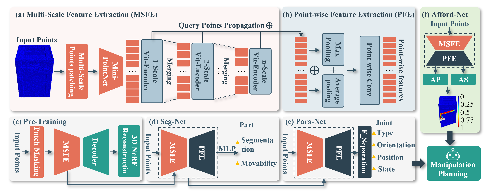

# GMAP: Generalized Manipulation of Articulated Objects Using Pre-trained Model

[](https://ojs.aaai.org/index.php/AAAI/article/view/33615)
[](https://www.python.org/)
[](https://pytorch.org/)

[Paper](https://ojs.aaai.org/index.php/AAAI/article/view/33615) | [Code](https://github.com/xavier-zenghl/GMAP)

## Abstract

Precise perception and dexterous manipulation of articulated objects remain central challenges for service robots. Existing approaches typically address perception and manipulation in isolation, limiting their generalization across diverse object categories. We present **GMAP**, a unified framework that systematically integrates the entire pipeline from perception to manipulation of articulated objects. GMAP introduces a multi-scale point cloud feature extraction module (MSFE) with a pre-training and fine-tuning paradigm to overcome the scarcity of annotated articulated object data. The framework performs part-level segmentation, estimates geometric and kinematic joint parameters, evaluates point-level affordance proposals, and dynamically computes robot execution trajectories. Extensive experiments demonstrate that GMAP achieves state-of-the-art performance in both perception and manipulation of articulated objects across seven object categories.

<p align="center">
  
</p>

## Installation

### Requirements

- Python >= 3.8
- PyTorch >= 1.12
- CUDA 11.x
- SAPIEN >= 2.0 (for simulation evaluation)

```bash
# Clone repository
git clone https://github.com/xavier-zenghl/GMAP.git
cd GMAP

# Install dependencies
pip install -r requirements.txt

# Install pointnet2_ops (requires CUDA toolkit)
pip install git+https://github.com/erikwijmans/Pointnet2_PyTorch.git#subdirectory=pointnet2_ops_lib

# Install SAPIEN (optional, for simulation evaluation)
pip install sapien

# Install package
pip install -e .
```

> **Note:** If `pointnet2_ops` is not installed, the code automatically falls back to a pure PyTorch implementation of FPS/KNN (slower but functionally equivalent).

## Data Preparation

### 1. ShapeNet55 (Pre-training)

Download the ShapeNet55 dataset (processed by [Point-BERT](https://github.com/lulutang0608/Point-BERT)) and place it in `data/ShapeNet55/`:

```text
data/ShapeNet55/
├── train.h5    # keys: "data" (N, 8192, 3), "label" (N,)
└── test.h5
```

### 2. PartNet-Mobility (Downstream Tasks)

Register at [SAPIEN](https://sapien.ucsd.edu/) and download PartNet-Mobility models. Organize the data in `data/PartNetMobility/`:

```text
data/PartNetMobility/
├── train.txt               # Object ID list for training
├── val.txt                 # Object ID list for validation
├── test.txt                # Object ID list for testing
└── <object_id>/            # One directory per object
    ├── point_cloud.npy     # (8192, 3) point cloud
    ├── seg_label.npy       # (8192,) part segmentation labels
    ├── movable_label.npy   # (8192,) movability labels
    └── joint_params.json   # Joint parameters (type, axis, position, state)
```

## Training

### Stage 1: VQ-VAE Pre-training (ShapeNet, 300 epochs)

Pre-train the MSFE backbone with masked token prediction on ShapeNet55:

```bash
python -m gmap.train.train_pretrain --config configs/pretrain.yaml
```

### Stage 2: Downstream Fine-tuning (PartNet-Mobility, 100 epochs each)

```bash
# Seg-Net: Part segmentation + movability prediction
python -m gmap.train.train_segnet --config configs/segnet.yaml

# Para-Net: Joint parameter estimation
python -m gmap.train.train_paranet --config configs/paranet.yaml

# Afford-Net: Affordance prediction
python -m gmap.train.train_affordnet --config configs/affordnet.yaml
```

### Stage 3: Simulation Evaluation

```bash
python -m gmap.simulation.evaluate_sim \
    --config configs/simulation.yaml \
    --segnet_ckpt checkpoints/segnet/epoch_100.pth \
    --paranet_ckpt checkpoints/paranet/epoch_100.pth \
    --affordnet_ckpt checkpoints/affordnet/epoch_100.pth
```

## Evaluation

```bash
# Run all unit tests
python -m pytest tests/ -v
```

## Project Structure

```text
gmap/
├── gmap/
│   ├── models/               # Network architectures
│   │   ├── msfe.py           # Multi-Scale Feature Extractor (3-scale ViT)
│   │   ├── dvae.py           # Discrete VAE tokenizer (Gumbel-Softmax)
│   │   ├── pfe.py            # Point-level Feature Propagation
│   │   ├── pretrain.py       # VQ-VAE masked pre-training model
│   │   ├── segnet.py         # Part segmentation + movability
│   │   ├── paranet.py        # Joint parameter estimation
│   │   ├── affordnet.py      # Affordance prediction (proposal + scoring)
│   │   ├── transformer.py    # ViT encoder blocks
│   │   └── pointnet2_utils.py # FPS, KNN, multi-scale grouping
│   ├── data/                  # Dataset loading
│   │   ├── shapenet_dataset.py
│   │   ├── partnet_dataset.py
│   │   └── transforms.py
│   ├── train/                 # Training scripts
│   │   ├── train_pretrain.py
│   │   ├── train_segnet.py
│   │   ├── train_paranet.py
│   │   └── train_affordnet.py
│   ├── eval/                  # Evaluation metrics
│   │   └── metrics.py        # mIoU, axis error, position error
│   ├── planner/               # Trajectory planning
│   │   └── trajectory.py     # Revolute / prismatic trajectory generation
│   ├── simulation/            # SAPIEN simulation
│   │   ├── env.py            # Articulated object environment
│   │   ├── robot.py          # Panda robot controller
│   │   └── evaluate_sim.py   # End-to-end evaluation pipeline
│   └── utils/                 # Utilities
│       ├── logger.py
│       ├── checkpoint.py
│       └── pc_utils.py
├── configs/                   # YAML configuration files
├── tests/                     # Unit tests (33 tests)
├── setup.py
└── requirements.txt
```

## Acknowledgements

This project builds upon several excellent open-source projects:

- [SAPIEN](https://sapien.ucsd.edu/) for the articulated object simulation platform
- [Pointnet2_PyTorch](https://github.com/erikwijmans/Pointnet2_PyTorch) for PointNet++ CUDA operations
- [Point-BERT](https://github.com/lulutang0608/Point-BERT) for the dVAE tokenizer design
- [Point-MAE](https://github.com/Pang-Yatian/Point-MAE) for masked autoencoder pre-training
- [PyTorch](https://pytorch.org/) as the deep learning framework

## Citation

```bibtex
@inproceedings{zeng2025gmap,
  title     = {GMAP: Generalized Manipulation of Articulated Objects in Robotic Using Pre-trained Model},
  author    = {Zeng, Hongliang and Zhang, Ping and Li, Fang and Yi, Qiong and Ye, Tingyu and Wang, Jiahua},
  booktitle = {Proceedings of the AAAI Conference on Artificial Intelligence},
  volume    = {39},
  number    = {14},
  pages     = {14736--14744},
  year      = {2025}
}
```

## License

This project is licensed under the MIT License - see the [LICENSE](LICENSE) file for details.
